####*```MadSDF.glsl```*
#### 2D Signed Distance Fields Library

MadSDF is a small library that allows to create clean and fast 2d graphics in MadMapper materials.
Distance fields are mathematical functions that can be used to describe shapes and this library ease the process of working with such functions. SDF are often used to render clean fonts at any resolutions but can also be used to render pretty much any 2d primitive. Have a look at Inigo Quilez [article](http://iquilezles.org/www/articles/distfunctions/distfunctions.htm), the [Nvidia Gpu Gem](http://http.developer.nvidia.com/GPUGems3/gpugems3_ch34.html) or the [Wikipedia page](https://en.wikipedia.org/wiki/Signed_distance_function) on the subject for an introduction on the theory.

The library is organized around 4 groups of functions. A series of graphic primitives functions (distance fields primitives), functions that allows to manipulate primitives (operator functions), a few basic coloring functions (colouring functions) and finally functions that allows to clone, compose or manipulate your 2d graphics (domain manipulation).

Working with the library usually involve at least two of the 4 steps mentionned above :

```c++
// We first generate the distance field of a circle
// This is our graphic primitive.
float radius 	= 0.25f;
vec2 position	= vec2( 0.5f );
float distField	= circle( uv - position, radius );

// To display it on the screen we need to generate
// a color from the signed distance field
vec3 circleColor 		= vec3( 1.0f );
vec3 backgroundColor 	= vec3( 0.0f );
vec3 color 				= fill( backgroundColor, circleColor, distField );
```
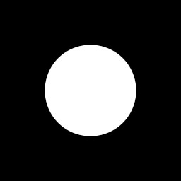

The last group of functions allows to provide more than just a position to the distance field function. This is the reason we often talk about domain instead of position : 

```c++
// We start by setting up our domain
vec2 center = vec2( 0.5f );
vec2 domain = repeat( uv-center, vec2( 0.1f ) );

// We generate the distance field of a circle
// This time instead of providing circle with a 
// "position" we pass our "domain" variable
float radius    = 0.025f;
float distField	= circle( domain, radius );

// Render the signed distance field
vec3 circleColor 		= vec3( 1.0f );
vec3 backgroundColor 	= vec3( 0.0f );
vec3 color 				= fill( backgroundColor, circleColor, distField );
```
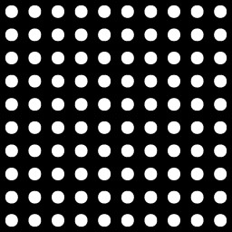

The second group is similar to Illustrator pathfinder functions, and allow to apply boolean operators on shapes. 

```c++
// We'll start with our first basic circle example
vec2 position = vec2( 0.5f );
float distFieldA = circle( uv - position, 0.25f );

// This time before colouring our circle we apply
// a distance operator on it to create a different shape
// We start by creating a second circle, slightly smaller
float distFieldB = circle( uv - position, 0.15f );
// Then substract it from the first one
float distField = subtract( distFieldA, distFieldB );

// Render the signed distance field
vec3 circleColor = vec3( 1.0f );
vec3 backgroundColor = vec3( 0.0f );
vec3 color = fill( backgroundColor, circleColor, distField );
```

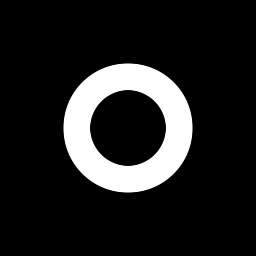


If we go back to the second example where we repeat our domain and draw a grid of circle, we can again see that the same small modification will repeat our new shape. 
```c++
// We start by setting up our domain
vec2 center = vec2( 0.5f );
vec2 domain = repeat( uv-center, vec2( 0.1f ) );

// We first generate the distance field of a circle
// Generate the two circles.
float distFieldA = circle( domain, 0.025f );
float distFieldB = circle( domain, 0.015f );

// Create the resulting distance field
float distField = subtract( distFieldA, distFieldB );

// and render it
vec3 circleColor = vec3( 1.0f );
vec3 backgroundColor = vec3( 0.0f );
vec3 color = fill( backgroundColor, circleColor, distField );
```
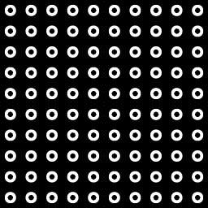

**The great thing with SDFs is that even with a 10 by 10 grid of anti-aliased circles the rendering cost stay pretty low. We could have 100000 circles instead of 100 performance would probably stay the same.**


This pretty much sums up how the library can be used to draw graphics. We start by setting up a domain ( which is going to discribe where our shapes are going to be, how they are going to be oriented or scaled, if they are going to repeat, etc... ) then usually follow by creating a distance field out of it ( representing a 2d primitive ), optionally modify the field by substracting or merging other shape(s) and finally we compose the results by combining one or several colouring functions.


####Distance Fields Primitives

Primitives functions signatures are usually self explanatory : 

```c++
vec3 color  = vec3( 0.0f );
color       = fill( color, vec3( 1.0 ), circle( uv, vec2( 0.25f, 0.5f ), 0.1f ) );
color       = fill( color, vec3( 1.0 ), rectangle( uv, vec2( 0.5f, 0.5f ), 0.1f ) );
color       = fill( color, vec3( 1.0 ), triangle( uv, vec2( 0.75f, 0.47f ), 0.125f ) );
```


They usually come in two flavors, one that accept the domain and a set of parameters and a second one that accept a domain, a position/offset and a set of parameters (as seen in the example above).

```c++
//! Returns the signed distance of a circle
float circle( vec2 p, float radius );
//! Returns the signed distance of a circle
float circle( vec2 p, vec2 center, float radius );
//! Returns the signed distance of a box
float rectangle( vec2 p, float radius );
//! Returns the signed distance of a box
float rectangle( vec2 p, vec2 size );
//! Returns the signed distance of a box
float rectangle( vec2 p, vec2 center, float radius );
//! Returns the signed distance of a box
float rectangle( vec2 p, vec2 center, vec2 size );
//! Returns the signed distance of a rounded box
float roundedRectangle( vec2 p, vec2 size, float cornerRadius );
//! Returns the signed distance of a rounded box
float roundedRectangle( vec2 p, vec2 center, vec2 size, float cornerRadius );
//! Returns the signed distance of a triangle
float triangle( vec2 p, float radius );
//! Returns the signed distance of a triangle
float triangle( vec2 p, vec2 center, float radius );
//! Returns the signed distance of an hexagon
float hexagon( vec2 p, float radius );
//! Returns the signed distance of an hexagon
float hexagon( vec2 p, vec2 center, float radius );
//! Returns the signed distance of a line
float line( vec2 p, vec2 start, vec2 end, float width );
//! Returns the signed distance of an arc
float arc( vec2 p, float radius, float angle, float width );
```
####Colouring functions

As seen previously colouring function is usually the very last step that we use to give a colour to a distance field. The field itself can also be visualised by outputing straight away as a grayscale color:

```c++
float sdf = circle( uv, vec2( 0.5f ), 0.125f );
vec3 color = vec3( sdf );
```
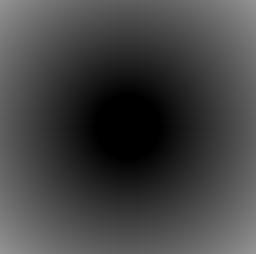

Or by using the glsl ```fract``` or ```sin``` functions:
```c++
float sdf = circle( uv, vec2( 0.5f ), 0.125f );
vec3 color = vec3( sin( sdf * 100.0 ) );
```
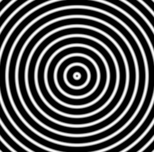

But you usually want to ouput the shape represented by the field instead of the field itself. 

```c++
//! Returns the colored inner distance field
vec3 fill( vec3 a, vec3 b, float dist );
//! Returns the colored inner distance field
vec4 fill( vec4 a, vec4 b, float dist );
//! Returns the colored border of the distance field
vec3 stroke( vec3 a, vec3 b, float dist, float width );
//! Returns the colored border of the distance field
vec4 stroke( vec4 a, vec4 b, float dist, float width );
```

The reason the ```fill``` and ```stroke``` functions accept two colors instead of one, is that the function actually shades every fragment in your Material, not only the one inside your shape. For this reason you give both the background color and the drawing color. This also allows to easily combine different shapes as seen here:

```c++
// background color
vec3 color = vec3( 0.65f );
// centered white circle with black stroke
float fieldA = circle( uv, vec2( 0.5f ), 0.125f );
color = fill( color, vec3( 1.0f ), fieldA );
color = stroke( color, vec3( 0.0f ), fieldA, 0.025f );
// small gray circle
float fieldB = circle( uv, vec2( 0.575f ), 0.05f );
color = fill( color, vec3( 0.25f ), fieldB );
```
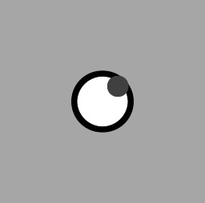

The last colouring function is used as an additive step and can give a glowing effect to your shapes. For this reason the function doesn't take a second background color as input but only the color and the size of the glow.

```c++
//! Returns the colored blurred border of the distance field
vec3 glow( vec3 color, float dist, float width );
//! Returns the colored blurred border of the distance field
vec4 glow( vec4 color, float dist, float width );
```

Instead of overriding the current color with a new one as we did before, we add the glow to the previous result by using the ```+``` operator :

```c++
// background color
vec3 color = vec3( 0.0f );
// white circle
float field = circle( uv, vec2( 0.5f ), 0.125f );
color = fill( color, vec3( 1.0f ), field );
// red glow
color += glow( vec3( 1.0f, 0.0f, 0.0f ), field, 0.1f );
```
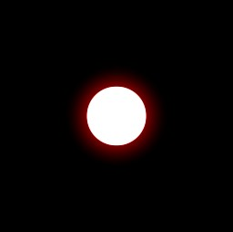

You can combine different layers of glow to create complex effects, faking volumetric light scattering or creating glowing particles.

```c++
// background color
vec3 color = vec3( 0.0f );
// glowing particle
float field = circle( uv, vec2( 0.5f ), 0.025f );
color = fill( color, vec3( 1.0f ), field );
color += glow( vec3( 1.0f ), field, 0.75f ) * 0.35f;
color += glow( vec3( 1.0f, 0.0f, 0.0f ), field, 0.5f ) * 0.5f;
color += glow( vec3( 1.0f ), field, 0.25f ) * 0.5f;
color += glow( vec3( 1.0f, 0.0f, 0.6f ), field, 0.1f );
color += glow( vec3( 1.0f ), field, 0.035f );
```
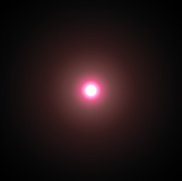


####Distance Operators
The signed distance fields operator functions are pretty straight forward. They take two distance fields and return the union, subtraction or intersection of the two inputs.

```c++
//! Returns the union of two signed distance field
float blend( float d1, float d2 );
//! Returns the smooth blend of two signed distance field
float smoothBlend( float d1, float d2, float k );
//! Returns the subtraction of a signed distance field by another signed distance field 
float subtract( float d1, float d2 );
//! Returns the intersection of two signed distance field
float intersect( float d1, float d2 );
```

The ```blend``` function returns the boolean union of two distance fields. Obviously the negative parts of both fields have to overlap to see the result.

```c++
float circleA = circle( translate( uv, vec2( 0.35f, 0.5f ) ), 0.125f );
float circleB = circle( translate( uv, vec2( 0.65f, 0.5f ) ), 0.125f );
float union = blend( circleA, circleB );

vec3 color = vec3( 0.75f );
color = fill( color, vec3( 1.0f ), union );
color = stroke( color, vec3( 0.0f ), union, 0.005f );
```
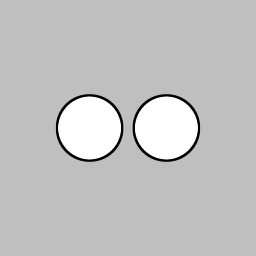

This can be used to create more complex shapes out of a series of primitives:

```c++
float circleA = circle( translate( uv, vec2( 0.4f, 0.5f ) ), 0.125f );
float circleB = circle( translate( uv, vec2( 0.6f, 0.5f ) ), 0.125f );
float union = blend( circleA, circleB );

vec3 color = vec3( 0.75f );
color = fill( color, vec3( 1.0f ), union );
color = stroke( color, vec3( 0.0f ), union, 0.005f );
```
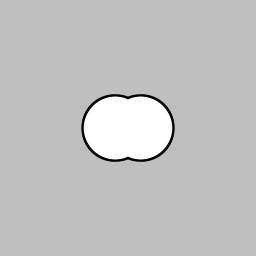

The ```smoothBlend``` function works the same way except that it creates a smooth transitions between shapes, even if they don't overlap:

```c++
float circleA = circle( translate( uv, vec2( 0.3f, 0.5f ) ), 0.125f );
float circleB = circle( translate( uv, vec2( 0.7f, 0.5f ) ), 0.125f );
float union = smoothBlend( circleA, circleB, 0.4f );

vec3 color = vec3( 0.75f );
color = fill( color, vec3( 1.0f ), union );
color = stroke( color, vec3( 0.0f ), union, 0.005f );
```
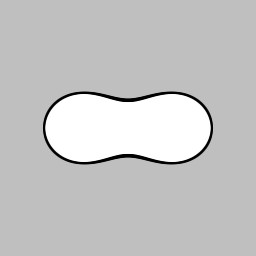

The ```subtract``` function returns the boolean subtraction of one field from another field.

```c++
float circleA = circle( translate( uv, vec2( 0.4f, 0.5f ) ), 0.25f );
float circleB = circle( translate( uv, vec2( 0.6f, 0.5f ) ), 0.25f );
float sub = subtract( circleA, circleB );

vec3 color = vec3( 0.75f );
color = fill( color, vec3( 1.0f ), sub );
color = stroke( color, vec3( 0.0f ), sub, 0.005f );
```
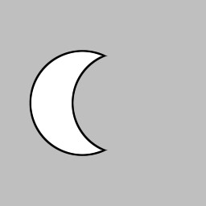

The ```interesct``` function works the same way and as mentionned above use together with other *distance operators* can help creating shapes more complex than the few basic primitives.

```c++
float circleA = circle( translate( uv, vec2( 0.4f, 0.5f ) ), 0.25f );
float circleB = circle( translate( uv, vec2( 0.6f, 0.5f ) ), 0.25f );
float subA = subtract( circleA, circleB );
float subB = subtract( circleB, circleA );
float union = blend( circleA, circleB );
float inters = intersect( circleA, circleB );

vec3 color = vec3( 0.75f );
color = fill( color, vec3( 1.0f, 0.0f, 0.0f ), subA );
color = fill( color, vec3( 0.0f, 1.0f, 0.0f ), subB );
color = fill( color, vec3( 0.0f, 0.0f, 1.0f ), inters );
color = stroke( color, vec3( 0.0f ), inters, 0.005f );
color = stroke( color, vec3( 0.0f ), subA, 0.005f );
color = stroke( color, vec3( 0.0f ), subB, 0.005f );
```


####Domain Transform
#####2D Transforms

*2D Transforms* are used to move, scale, rotate or apply any transformation to a domain.

```c++
//! Returns a translated position
vec2 translate( vec2 p, vec2 t );
//! Returns a rotated position
vec2 rotate( vec2 p, float a );
//! Returns a transformed position
vec2 transform( vec2 p, mat2 m );
```

You can of course chain them to produce the desired transformation :
```c++
vec3 color  = vec3( 0.0f );
color       = fill( color, vec3( 1.0 ), triangle( translate( uv, vec2( 0.25f, 0.5f ) ), 0.1f ) );
color       = fill( color, vec3( 1.0 ), 
				triangle( rotate( translate( uv, vec2( 0.5f, 0.55f ) ), 3.1415 ), 0.1f ) );
color       = fill( color, vec3( 1.0 ), triangle( translate( uv, vec2( 0.75f, 0.5f ) ), 0.1f ) );
```


#####Domain Transforms

*Domain Transforms* are slightly less intuitive but quite powerful. You can use that type of functions to repeat any shape in on any axis, in a regular or irregular grid or radially. 

```c++
//! Returns the repeated position every offset
vec2 repeat( vec2 p, vec2 offset );
//! Returns the repeated position every offset with the ID for the current cell
vec2 repeat( vec2 p, vec2 offset, out vec2 cellId );
//! Returns the repeated position with an offset between each a of size b
vec2 repeat( vec2 p, vec2 offset, vec2 a, vec2 b );
//! Returns the repeated position with an offset between each a of size b with the ID for the current cell
vec2 repeat( vec2 p, vec2 offset, vec2 a, vec2 b, out vec2 cellId );
//! Returns the repeated position radially each angle
vec2 repeatRadial( vec2 p, float angle );
//! Returns the repeated position radially each angle with the ID for the current cell
vec2 repeatRadial( vec2 p, float angle, out vec2 cellId );
//! Returns the repeated position radially each angle starting at angleOffset
vec2 repeatRadial( vec2 p, float angle, float angleOffset );
//! Returns the repeated position radially each angle starting at angleOffset with the ID for the current cell
vec2 repeatRadial( vec2 p, float angle, float angleOffset, out vec2 cellId );
```

The only confusing part comes from the fact that you have to do this step before creating the actual shape you want to repeat. The same way you would translate the whole distance field, you can also repeat it.

```c++
// the domain transform happens first
vec2 domain = repeat( uv, vec2( 0.1f ) );
// and then only the creation of the field
float crossSdf = blend( 
    rectangle( domain, vec2( 0.025f, 0.0125f ) ),
    rectangle( domain, vec2( 0.0125f, 0.025f ) )
    );
// render the sdf
vec3 color  = vec3( 0.75f );
color       = fill( color, vec3( 1.0f ), crossSdf );
```
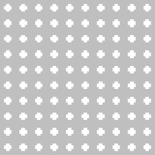

As usual the order of operation will change the result. In this example we rotate before repeating:
```c++
vec2 domain = rotate( uv, PI * 0.25f );
domain = repeat( domain, vec2( 0.1f ) );
float crossSdf = blend( 
    rectangle( domain, vec2( 0.025f, 0.0125f ) ),
    rectangle( domain, vec2( 0.0125f, 0.025f ) )
    );
// render the sdf
vec3 color  = vec3( 0.75f );
color       = fill( color, vec3( 1.0f ), crossSdf );
```
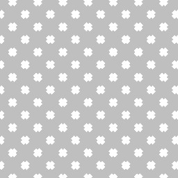

Where here we repeat first before rotating the whole domain:
```c++
vec2 domain = repeat( uv, vec2( 0.1f ) );
domain = rotate( domain, PI * 0.25f );
float crossSdf = blend( 
    rectangle( domain, vec2( 0.025f, 0.0125f ) ),
    rectangle( domain, vec2( 0.0125f, 0.025f ) )
    );
// render the sdf
vec3 color  = vec3( 0.75f );
color       = fill( color, vec3( 1.0f ), crossSdf );
```
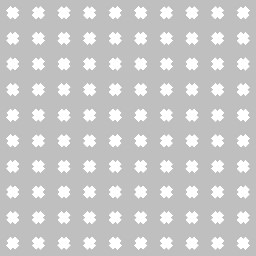

It might help sometimes to think of it while reversing the order of operations. The first example would be "render a cross", "repeat it every vec2( 0.1f )" and "rotate the whole thing by PI/4", while the second example would be "render a cross", "rotate it by PI/4" and "repeat it every vec2( 0.1f )".

There is another variations of the ```repeat``` functions that allows to setup offsets between each repetition. This can be usefull when creating different type of tiling patterns. Here's the usual brick wall:

```c++
vec2 size   = vec2( 0.25f, 0.125f );
vec2 offset = vec2( size.x * 0.5f, 0.0f );
vec2 domain = repeat( vUv, size, offset, vec2( 2 ) );
float brick = rectangle( domain, size * 0.45f );
vec3 color  = vec3( 0.0f );
color       = fill( color, vec3( 1.0f ), brick );
```
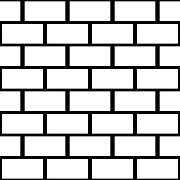


```repeatRadial``` needs a tiny bit more work as we need to define how the field has to repeat. Not setting up the domain properly in this case would result in having all the repetition in ```0,0```. This is the reason the following code involve two ```translate```:

```c++
// we first translate everything to the center
vec2 domain = translate( uv, vec2( 0.5f, 0.5f ) );
// then repeat radially every PI / 5.0f
domain = repeatRadial( domain, PI / 5.0f );
// and finally move a bit horizontally to have a circle of shapes
domain = translate( domain, vec2( 0.25f, 0.0f ) );

float crossSdf = blend( 
    rectangle( domain, vec2( 0.05f, 0.025f ) ),
    rectangle( domain, vec2( 0.025f, 0.05f ) )
    );
// render the sdf
vec3 color  = vec3( 0.0f );
color       = fill( color, vec3( 1.0f ), crossSdf );
```
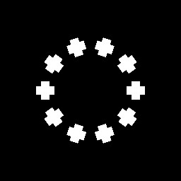

Every *domain transform* functions come with a "cellId" variant. They can be used to keep track of the current cell ID amd apply different effect depending on the cell. For example combined with a noise we can add variation to one of the previous examples:

Let's start by outputing the ```cellId``` as the background color of each cell. As you can see each cell of the repetition receive a different value.

```c++
// we pass an extra cellId parameter to the repeat function
vec2 cellId;
vec2 domain = repeat( uv, vec2( 0.2f ), cellId );
float crossSdf = blend( 
    rectangle( domain, vec2( 0.05f, 0.025f ) ),
    rectangle( domain, vec2( 0.025f, 0.05f ) )
    );
// and output it as the background color
vec3 color  = vec3( cellId * 0.2f, 0.0f );
color       = fill( color, vec3( 1.0f ), crossSdf );
```
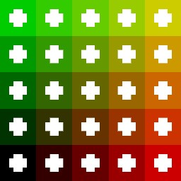

This change of value can be used to feed a random number generator or a noise function to produce the variation we suggested above.

```c++
// we pass an extra cellId parameter to the repeat function
vec2 cellId;
vec2 domain = repeat( uv, vec2( 0.2f ), cellId );
// and use it to generate a 2d noise for the size of each cross
float size = noise( cellId ) * 0.5f + 1.0f;
float crossSdf = blend( 
    rectangle( domain, vec2( 0.05f, 0.025f ) * size ),
    rectangle( domain, vec2( 0.025f, 0.05f ) * size )
    );
// and a second one for a random fill color
float gray  = noise( cellId + vec2( 12.34f ) ) * 0.5f + 0.65f;
vec3 color  = vec3( 0.75f );
color       = fill( color, vec3( gray ), crossSdf );
```
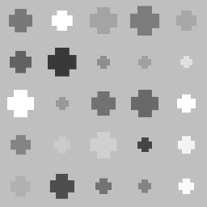


#####Plane Deformations

Plane deformations is a very old effect that can be used to manipulate the domain used by our distance field functions. This library has been written in a really verbose fashion. But if you have a look at the implementation, you'll see that most operators are short and often quite simple. Same goes for other types of domain deformations. All sort of Glsl functions like ```clamp```, ```floor```, ```mod```, etc... can be used to produce surprising results. Some will be correct from a distance field maths perspective, some will create issues but it's fairly easy to experiment with it. Here's a nice [intro](http://www.iquilezles.org/www/articles/deform/deform.htm) by Inigo Quilez (see formulas at the end).

A simple example would be to start with the old school tunnel effect. Which is also surprisingly simple.

```c++
// we start by centering everything with a small vertical offset
vec2 domain = translate( uv, vec2( 0.5f, 0.25f ) );
// then the deceivingly simple one-liner responsible for the tunnel effect
domain      = vec2( domain.x, 1.0f ) / abs( domain.y ) + vec2( 0, time );
// and finally we repeat the domain as before
domain      = repeat( domain, vec2( 0.3f ) );
float sdf   = rectangle( domain, vec2( 0.05f ) );
// render the sdf
vec3 color  = vec3( 0.0f );
color       = fill( color, vec3( 1.0 ), sdf );
```
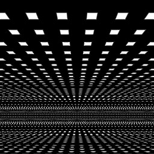

An easy variation would to add a rotation matrix and use that to modify the domain before applying the tunnel effect.

```c++
// we start by centering everything with a small vertical offset
vec2 domain = translate( uv, vec2( 0.5f, 0.25f ) );
// add an extra step before the tunnel one-line
domain      = mat2( cos( time.x ), -sin( time.x ), sin( time.x ), cos( time.x ) ) * domain;
domain      = vec2( domain.x, 1.0f ) / abs( domain.y ) + vec2( 0, time.y );
// and finally we repeat the domain as before
domain      = repeat( domain, vec2( 0.3f ) );
float sdf   = rectangle( domain, vec2( 0.05f ) );
// render the sdf
vec3 color  = vec3( 0.0f );
color       = fill( color, vec3( 1.0 ), sdf );
```
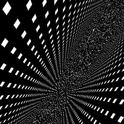

That kind of effect can quickly break the distance field and you might end up with artifacts in your rendering. In this case the perspective effect also makes it really difficult for the anti-aliasing to work properly. An easy way to fix it in this case is to use a cheap fog:

```c++
vec2 domain = translate( uv, vec2( 0.5f, 0.25f ) );
domain      = mat2( cos( time.x ), -sin( time.x ), sin( time.x ), cos( time.x ) ) * domain;
domain      = vec2( domain.x, 1.0f ) / abs( domain.y ) + vec2( 0, time.y );
// we use the y component of the domain before repeating 
// as a gradient to fake a fog
float fog   = 1.0f - domain.y * 0.1f;
domain      = repeat( domain, vec2( 0.3f ) );
float sdf   = rectangle( domain, vec2( 0.05f ) );
// render the sdf
vec3 color  = vec3( 0.0f );
color       = fill( color, vec3( fog ), sdf );
```
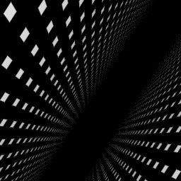

Something else that is probably totally wrong but fun to play with is to modulate the field directly with a noise. Here we play with two layers of noise and two gradients to give this deformed square:

```c++
vec2 domain = rotate( translate( uv, vec2( 0.5f, 0.5f ) ), 0.2f );
float sdf   = rectangle( domain, vec2( 0.25f ) );
sdf         += smoothstep( 0.5f, 0.65f, uv.x ) * noise( uv * 15.0f ) * 0.1f;
sdf         += smoothstep( 0.75f, 0.8f, uv.x ) * noise( uv * 45.0f ) * 0.05f;
vec3 color  = vec3( 0.0f );
color       = fill( color, vec3( 1.0f ), sdf );
``````
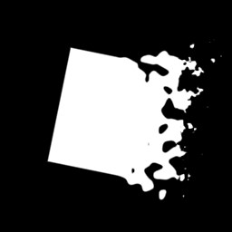